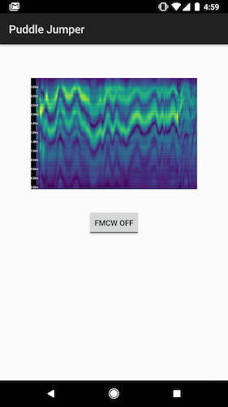

Puddle Jumper
-------------

Android app for sonar-based localization of microfluidic droplets. 

The app runs [FMCW](https://en.wikipedia.org/wiki/Continuous-wave_radar#Modulated_continuous-wave)-based sonar, using
an Android device's speaker and microphone.

This example shows the app responding to a hand moving back and forth
in front of the device:

To build, clone with `git clone --recursive` and then load the repository in Android Studio.

Work in progress.
